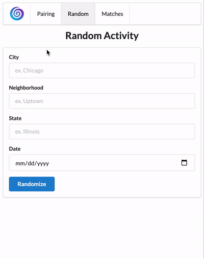

# hang

Pair up with people in your location based on common interests in a variety of activities. The only app which makes plans for you!

## Technologies Used

- React.js
- Node.js
- Express.js
- JavaScript ES6
- PostgreSQL
- Socket.IO
- Semantic UI
- CSS3

## Live Demo

Try the application live at [https://hang-web-app.herokuapp.com](https://hang-web-app.herokuapp.com)

## Features
- User can pair with another user for a selected activity
- User can pair with another user for a random activity
- User can accept/reject suggested activity with suggested partner
- User can view a list of all matches/activities
- User can send/receive live messages with partners they pair with

## Preview


## Development

### Getting Started

1. Clone the repository.

    ```shell
    git clone https://github.com/nickkniola/hang.git
    cd hang
    ```

2. Install dependencies.

    ```shell
    npm install
    ```

3. Start PostgreSQL server

    ```shell
    sudo service postgresql start
    pgweb --db=Hang
    ```

4. Start webpack

    ```shell
    npm run build
    ```

5. Visit http://localhost:3000 in browser
